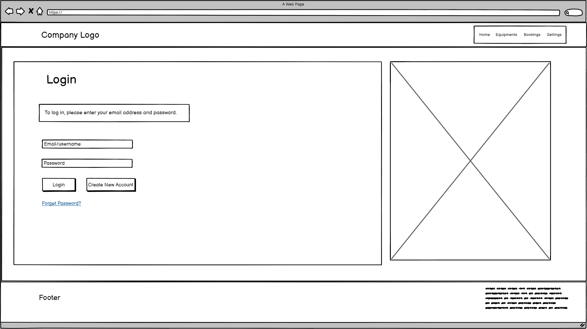
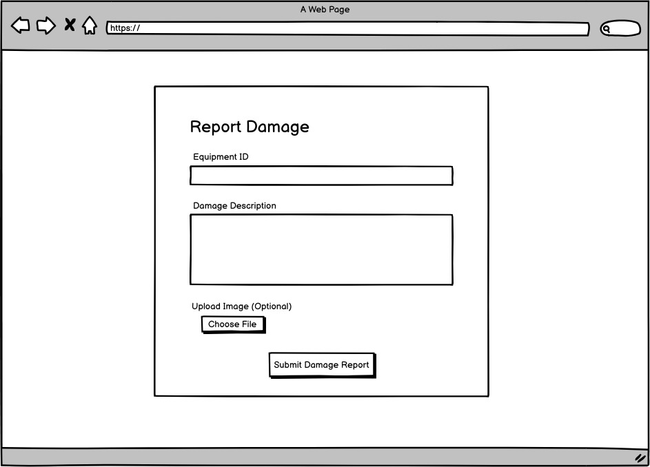

# Design Specification

### Requirement 1:  Login Form
The website shall provide a login form that accepts a username and password.
- Navigate to the login page.
- Enter email/username and password.
- Click "Login" to submit credentials.
- Option to create a new account or reset password if needed.

### Requirement 2:  Admin Portal
The website shall display a list containing all added equipment, and track and update equipment status.
- The main table shows the list of all added equipment. It includes equipment name, equipment ID, and quantity.
    - A search bar at the top left allows admins to search for equipment by name.
- Bottom right table displaying the confirm bookings.

### Requirement 3:  Damage reporting
The website shall provide a damage reporting form that allows users to select the equipment they want to report damage for.
- Essential fields to report damaged equipment.
    - Equipment ID, a text input field for users to enter the ID of the damaged equipment.
    - Damage Description, a large text box for users to describe the damage.
    - Upload Image, a file input option for users to upload an image of the damaged equipment.
- Submit Damage Report button allows users to submit the damage report.

### Requirement 4:  Availability and booking.
The Interface shall show the list of available equipment and have a button to book the equipment.
- Display a table containing all available equipment.
- A search bar at the top allows users to filter through the list of equipment.
- A table lists all available equipment with equipment name, description and availability.
- A calendar showing the availability and to select a cooking range.
- Book button to confirm the equipment booking.

### Requirement 5:  Adding equipment
The admin dashboard shall provide a form for adding new equipment.
- A form in the top-right panel enables the admin to add new equipment. Includes equipment name, description, and quantity.
- An add button to add the equipment entered in the form to the list.
- Reset button to clear the fields.

