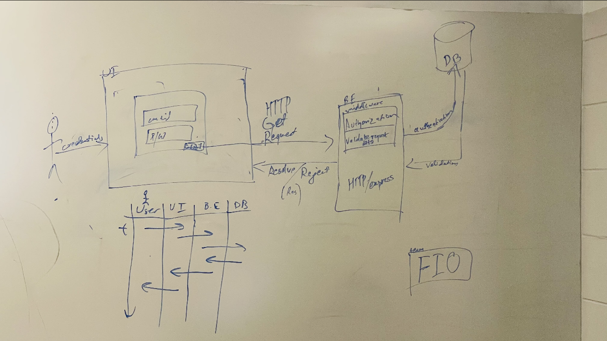

# Meeting Minutes (10/01/2024)

## Administrivia
<!-- The scribe is the person taking the _notes_. This is encouraged to be a single person to reduce problems. -->
* Time: 09:30 PM - 10:15 PM
* Location: Virtual
* Scribe: Adarsha Subedi

## Agenda
* Discuss Design Specification
  * DFDs and Swimlane diagrams

* Discuss Requirement Specification
  * Dates, Deadlines, Requirements for each user story

* Finalize Wireframes
  * Login/Signup and Admin 

## Notes

- In class Data Flow Diagram and Waterfall Diagram.

- We discussed the System's flow using DFD and Swimlane Diagrams which we drew on the board during class and discussed how it might need some adjustment during build. 

- We talked about user stories and break-down of different requirements of each user stories. We are assuming that we have to break down requirement of each user stories that we created before.

- Finally, we finalized wireframes for three main pages of our project.

## Action Items
- Finalization of Student View wireframe and Requirement Specification completion.

## Signatures
<!-- Add signatures on 10/01/2024 -->
Adarsha Subedi, Skylar Shaffer, Rob Pierce
