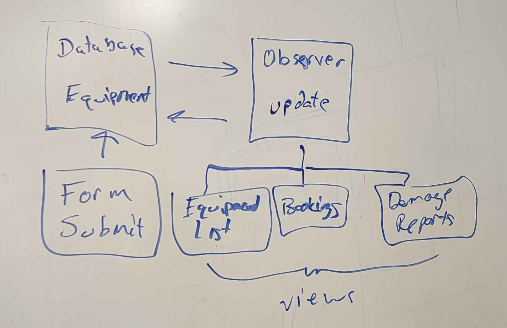

# Meeting Minutes (10/10/2024)

## Administrivia
<!-- The scribe is the person taking the _notes_. This is encouraged to be a single person to reduce problems. -->
* Time: 09:15 PM - 10:00 PM
* Location: Virtual
* Scribe: Skylar Shaffer

## Agenda
* In Class Observer Diagram

## Notes

We discussed programming structures and created a diagram of how the observer structure is applied within our project.

We also discussed our progress with milestone 3.

## Action Items
Milestone 3

## Signatures
<!-- Add signatures on 10/24/2024 -->
Estuardo Marroquin, Shishir Paudel, Skylar Shaffer, Adarsha Subedi, Rob Pierce
