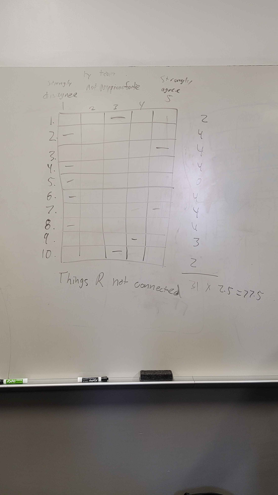

# Meeting Minutes (10/10/2024)

## Administrivia
<!-- The scribe is the person taking the _notes_. This is encouraged to be a single person to reduce problems. -->
* Time: 09:15 PM - 10:00 PM
* Location: Virtual
* Scribe: Skylar Shaffer

## Agenda
* SUS UX/UI Test
* Milestone 4

## Notes

In class we discussed UI/UX usability and worked with the group "Not My PianoForte" on grading each others projects as they are.
Noted of course that it is only early november so things are incomplete.

We recieved a respectable score of 77.5 from them as shown in the included image. Their biggest complaint is that our site is not connected yet. We gave them an 85 as their design was very clean and usable.

In the Discord meeting we discussed changes to the admin viwes and equipment views. Decided on moving the bookings view to a different page.

We have merged everything we have currently into main and think we are on track for milestone 4.

## Action Items
Milestone 4

## Signatures
<!-- Add signatures on 11/7/2024 -->

