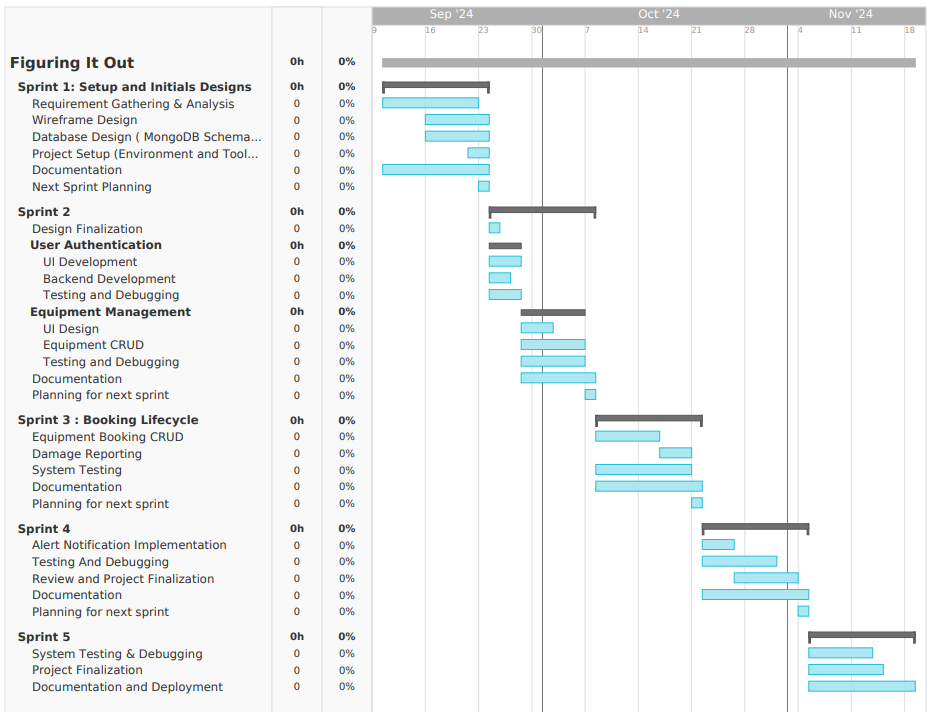

# Software Development Plan

## Communication Plan

As a team we plan to meet from 8:15pm to 9:00pm on Tuesdays and Thursdays via discord. This is the most convenient of the times we all have available. This window also allows for flexibility if the meeting needs to go longer. These meetings will take place over Discord Call.

We will make use of the given time at the end of class from 12:00pm to 12:20pm on Tuesdays to meet as well. These meetings will take place in class.

Each of these meetings are held weekly.

Outside of the specific meeting times we anticipate communicating via the text channels in our team discord.

### Meeting Location(s)

Tuesdays in FH 204 and on Discord
Thursday on Discord

### Meeting Time(s)

FH 204 from 12:00 PM to 12:20 PM
Discord from 9:15 PM to 10:00 PM on Tuesday
Discord from 8:15 PM to 9:00 PM on Thursday

### Meeting Cadence

Two days per week

### Communication mechanism(s) for outside of meetings

We anticipate communicating via Discord outside of meetings. We have committed to responding within a 2 day timeframe.

# Timeline

## Milestones

As also demonstrated on the Gantt Chart, we have anticipated the following milestones:

**Milestone 1:** Requirement Specifications to be completed by October 4, 2024

**Milestone 2:** Project Startup and Design Specifications to be ready by Oct 11, 2024

**Milestone 3:** User Authentication, Booking System, and Testing to be done by Oct 25, 2024

**Milestone 4:** Damage Reporting & Notification System to be completed by Nov 8, 2024

**Milestone 5:** Final Testing, Debugging and System Deployment to be completed by Nov 22, 2024

### MVSs Timeline

Following will be the features for the MVS of our System:

-**User Authentication System:** Basic login and registration for students and admins.

-**Equipment Availability Check:** Users can view available equipment.

-**Booking System:** Students can book equipment.

-**Admin Dashboard:** Admins can manage equipment and view booking status.

We anticipate it to be completed by Oct 28, 2024.

### Requirement Specification

Ready on October 4, 2024

### Design Specification

Ready on October 11, 2024.
